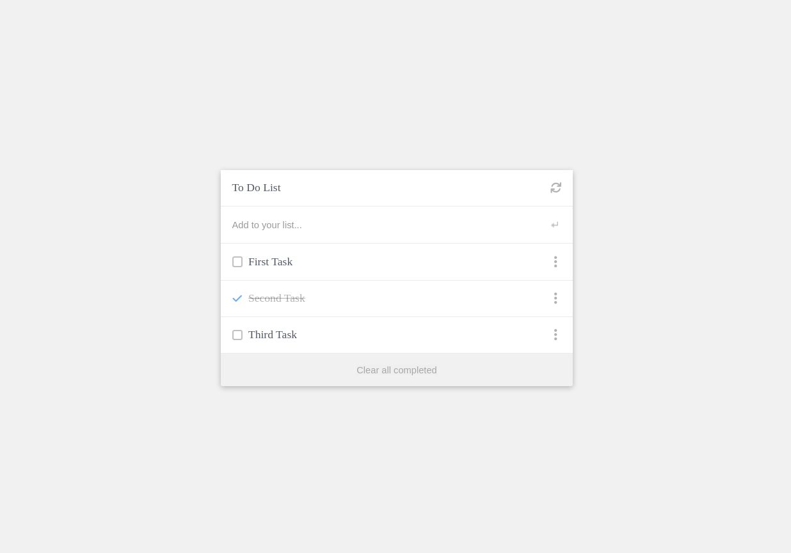

# To Do list Structure

> To Do list Structure

This is milestone is about making to do list markup + creating tasks section dynamically.

## Built With

- HTML, CSS, and JavaScript

## Live Demo

[Live Demo](https://amrhub.github.io/To-Do-list/dist)

To get a local copy up and running follow these simple example steps.

### Setup

To setup the webpack project starting template in your local, in the repo page:
click on code (dropdown list) > Download as ZIP.
or open terminal of path you want to install project and run this command  
`git clone git@github.com:Amrhub/To-Do-list.git`

### Deployment

To run the project open folder (after extraction) or cloning then run these commands:  
**`npm install`** to install all dependencies  
**`npm start`** to start the application, you should see the application working at: `http://localhost:8080/`

## Authors

👤 **Amr Ahmed**

- GitHub: [@Amrhub](https://github.com/Amrhub/)
- LinkedIn: [Amr Ahmed](https://www.linkedin.com/in/amr-ahmed-655420191/)

## 🤝 Contributing

Contributions, issues, and feature requests are welcome!

Feel free to check the [issues page](../../issues/).

## Show your support

Give a ⭐️ if you like this project!

## Acknowledgments

- Microverse helped/guided me building this project

## 📝 License

This project is [MIT](./MIT.md) licensed.
